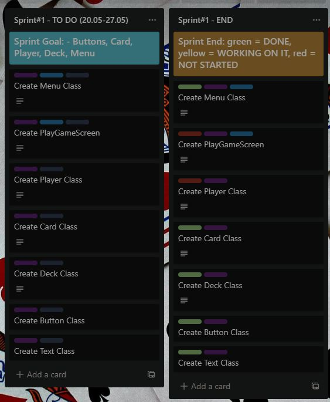
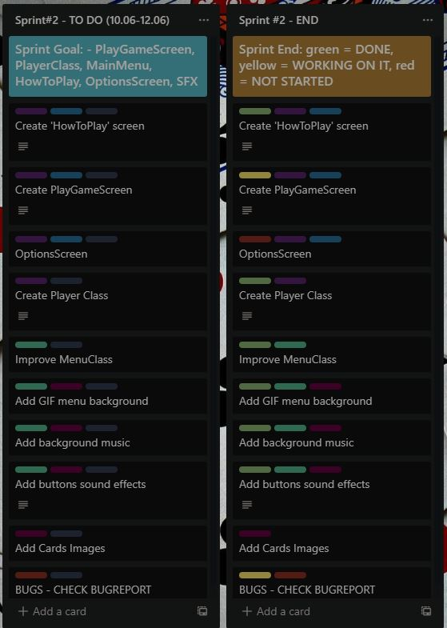

# MDS-Project
Software Development Methods - Project - 2nd year of University - Faculty of Mathematics and Informatics at the University of Bucharest

## Project team:

[comment]: # (finished)

- **[Capmare Alex](https://github.com/CapmareAlex)**
- **[Butelca Radu](https://github.com/abradu28)**
- **[Fritz Raluca](https://github.com/ralucafritz)**
- **[Rotaru Radu](https://github.com/radu-rotaru)**
- **[Visalon Giani](https://github.com/Giani2001)**

---

## Table of Contents

[comment]: # (finished)

[1. Project Description](#project-description)   
[2. Application demo](#application-demo)  
[3. Backlog](#backlog)  
[4. User Stories](#user-stories)  
[5. Bug Reporting](#bug-reporting)  
[6. UML Diagram](#uml-diagram)  
[7. Sourse Control](#source-control)  
[8. Automation Testing](#automation-testing)  
[9. Build Tool](#build-tool)  
[10. Code Standards](#code-standards)   
[11. Design Patterns](#design-patterns)  
    

## Project Description

[comment]: # (to be completed)

## Application demo 

[comment]: # (Ralu)

## Backlog

### Sprint#1

### Sprint#2

### Sprint#3

## User Stories

[comment]: # (finished)

- As a player, I want to play a simple card game without bugs.
- As a player, I want a variety of difficulty options to choose from.
- As a player, I appreciate decent sound effects and graphics.
- As a player, I want a simple UI so that I can find my way around the game.
- As a player, I want a game that is not repetitive.
- As a player, I want a game report after I finish a game to find out where I can improve my gameplay.
- As a player, I want to play games that challenge me.
- As a player, I want to have fun when playing games, and that means winning.
- As a player, I want to play games that require using only my mouse so that my boss doesn't figure out I'm playing during my work-hours.
- As a game tester, I want to test multiple scenarios in order to report possible bugs to the dev team.
- As a blog writer, I want to find card games I can write articles about for card games fans.
- As a member of the developer team, I want to have easy ways to communicate with my team in order to work faster and easier.
- As a scrum master, I want my team to do their tasks properly and in the specified timeframe so that we receive positive feedback from the client.
- As a client, I want fast and good results from the developer team.

## Bug Reporting

[comment]: # (each of us will write the bugs we encountered & fixed)

## UML Diagram

[comment]: # (Ralu)

## Source Control

[comment]: # (finished)

**Branches:** https://github.com/CapmareAlex/MDS-Project/branches
  - _branch-alex-capmare_ - contains the workspace used by **[Capmare Alex](https://github.com/CapmareAlex)**
  - _branch-raluca-fritz_  - contains the workspace used by **[Fritz Raluca](https://github.com/ralucafritz)**
  - _branch-radu-rotaru_  - contains the workspace used by **[Rotaru Radu](https://github.com/radu-rotaru)**
  - _branch-giani-visalon_  - contains the workspace used by **[Visalon Giani](https://github.com/Giani2001)**

**Commits:** https://github.com/CapmareAlex/MDS-Project/commits/main

## Automation Testing

[comment]: # (to be completed)

## Build Tool

[comment]: # (to be completed)

## Code Standards

[comment]: # (to be added or removed)

## Design Patterns

[comment]: # (to be completed)