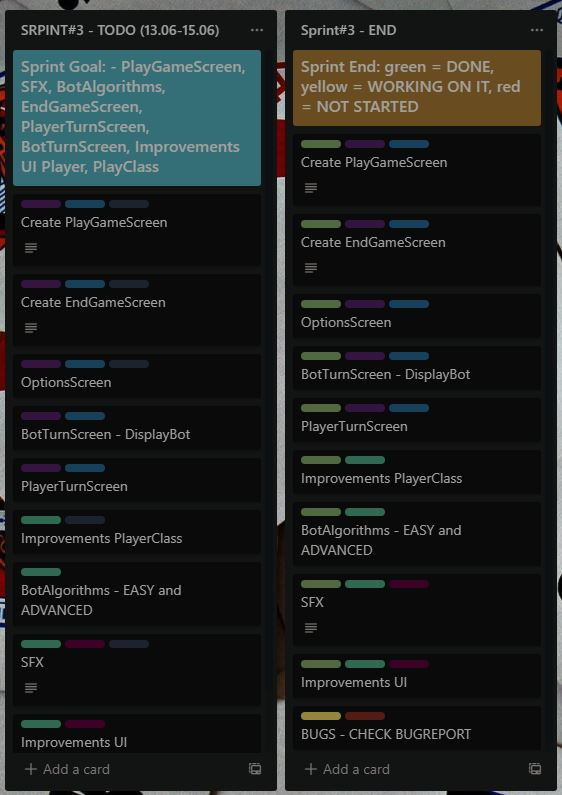

# MDS-Project
`Software Development Methods` - Project - 2nd year of University - Faculty of Mathematics and Informatics at the University of Bucharest

## Project team:

- **[Capmare Alex](https://github.com/CapmareAlex)**
- **[Butelca Radu](https://github.com/abradu28)**
- **[Fritz Raluca](https://github.com/ralucafritz)**
- **[Rotaru Radu](https://github.com/radu-rotaru)**
- **[Visalon Giani](https://github.com/Giani2001)**

---

## Table of Contents

[1. Project Description](#project-description)   
[2. Application demo](#application-demo)  
[3. Backlog](#backlog)  
[4. User Stories](#user-stories)  
[5. Bug Reporting](#bug-reporting)  
[6. UML Diagram](#uml-diagram)  
[7. Sourse Control](#source-control)  
[8. Automation Testing](#automation-testing)  
[11. Code refactoring](#code-refactoring)   
[12. Design Patterns](#design-patterns)  

## Project Description

Ideea de la baza proiectului a fost una simpla, anume de a crea un joc impotriva PC-ului, pornind de la jocul de societate "Minti", ce are ca drept scop aflarea celui care minte cel mai bine dintre toti. Pentru o intelegere mai simpla, este o versiune mai simpla a pokerului, eliminandu-se anumite tipuri de maini precum chinta sau culoarea, dar si miza. 
Regulile jocului sunt:
- castigator este cel care ramane in cele din urma la masa
- cine ajunge la 6 carti pierde
- la inceputul jocului, "primul la vorba" trebuie sa spuna o carte sau o combinatie de carti ce crede ca se afla la masa(adica ce are in mana sau are adversarul, calculatorul) astfel incat sa induca in eroare oponentul.
- in cazul in care oponentul spune "Minti" trebuie sa fie afisate cartile si daca o minciuna s-a produs, adica nu se afla la masa ceea ce s-a zis pentru ultima oara, player-ul trebuie sa ia o carte in plus; in caz contrar, calculatorul este cel care minte si trebuie sa ia o carte in plus;
- daca la un moment dat jucatorul spune o anumita carte, adversarul trebuie sa spuna ori "minti", ori sa ridice "stacheta", spunand o carte (sau combinatie) mai mare; 
- combinatiile de carti sunt pereche (2 carti de acelasi tip), cui (3 carti de acelasi tip), careu(4 carti de acelasi tip), urmand sa se mai adauge cu ocazie altor update-uri mai multe;

Deocamdata aplicatia permite doar  *player-PC*, __advanced__ si __easy__, urmand sa se implementeze pentru urmatoarele update-uri si modul multiplayer.

## Application demo 

[comment]: # (Ralu)

## Backlog

### Sprint #1 

### Sprint #2 

### Sprint #3 


## User Stories

- As a `player`, I want to play a simple card game without bugs.
- As a `player`, I want a variety of difficulty options to choose from.
- As a `player`, I appreciate decent sound effects and graphics.
- As a `player`, I want a simple UI so that I can find my way around the game.
- As a `player`, I want a game that is not repetitive.
- As a `player`, I want a game report after I finish a game to find out where I can improve my gameplay.
- As a `player`, I want to play games that challenge me.
- As a `player`, I want to have fun when playing games, and that means winning.
- As a `player`, I want to play games that require using only my mouse so that my boss doesn't figure out I'm playing during my work-hours.
- As a `game tester`, I want to test multiple scenarios in order to report possible bugs to the dev team.
- As a `blog writer`, I want to find card games I can write articles about for card games fans.
- As a `member of the developer team`, I want to have easy ways to communicate with my team in order to work faster and easier.
- As a `scrum master`, I want my team to do their tasks properly and in the specified timeframe so that we receive positive feedback from the client.
- As a `client`, I want fast and good results from the developer team.

## Bug Reporting

De-a lungul timpului, 	aplicația a suferit modificări pentru a ajunge la un joc care să funcționeze normal fără a întâlni anumite defecțiuni. Pentru a ajunge la un produs finit care să mulțumească clientul, jocul a avut parte de o serie de bug-uri care au fost rezolvate între timp. Bug-urile găsite de-a lungul împlementării au fost:

1. **Bug pentru afișarea cărții selectate**
   - problema întâmpinată era la selectarea cărților. 
   - inainte ca o alegere a unei cărți să fie făcută, toate cele 13 cărți au culoarea neagră, și când selectăm o carte aceasta să devină albă. 
   - O problemă era că doream să avem doar o singură carte selectată și numai una și dacă doream să ne răzgândim cu alegerea făcută întâi să refacem cartea în culoarea neagră pentru a putea selecta alta. 
   - Metoda folosită pentru rezolvarea acestei probleme a fost să reținem într-o listăculorile cărților înainte de a apăsa pe ele și când toate cărțile erau negre coloram numai o carte astfel încât să știm cartea selectată și numai una, astfel spus în listă să existe doar o carte de culoare alb, și pentru a schimba varianta întâi transformăm cartea albă în cartea neagră, și apoi selectăm cartea dorită

2. **Sound bug when trying to flip multiple cards**
   - it occurs when you select a card and you start clicking fast on another card that is not flipped
   - this bug is still _**not resolved**_.

3. **Sound bug when pressing on `Play`**
   - when pressing `Play`, the cards shuffle sound and the sound for pressing a button overlap and after both of them are finished, the screen changes
   - the main idea behind adding the shuffle cards sound was that the sound effect should be playing after the screen changes, followed by a delay in showing the UI elements
   - this bug is still _**not resolved**_.

## UML Diagram

[comment]: # (Ralu)

## Source Control

**Branches:** https://github.com/CapmareAlex/MDS-Project/branches
  - _branch-alex-capmare_ - contains the workspace used by **[Capmare Alex](https://github.com/CapmareAlex)**
  - _branch-raluca-fritz_  - contains the workspace used by **[Fritz Raluca](https://github.com/ralucafritz)**
  - _branch-radu-rotaru_  - contains the workspace used by **[Rotaru Radu](https://github.com/radu-rotaru)**
  - _branch-giani-visalon_  - contains the workspace used by **[Visalon Giani](https://github.com/Giani2001)**

**Commits:** https://github.com/CapmareAlex/MDS-Project/commits/main

## Automation Testing

[comment]: # (to be completed)

## Code refactoring
We have made many improvements to our code along the way, a few of the most recent ones are:

1. The sound effects and music have been moved to a new class called `SoundsUtil` where they are initalized and have their specific methods to 
   - play 
   - pause 
   - unpause
   - mute
   - unmute 
   - setvolume etc.

    ```python
        def buttonClickSoundPlay():
            buttonClickSound.play()
        def cardClickSoundPlay():
            cardClickSound.play()
        def shuffleSoundPlay():
            shuffleSound.play()
        .
        .
        .
        def musicPlay():
            pygame.mixer.music.play(-1)
        def musicPause():
            pygame.mixer.music.pause()
        def musicUnpause():
            pygame.mixer.music.unpause()
        def musicStop():
            pygame.mixer.music.fadeout(20)
    ```
Those changes were made in this [commit](https://github.com/CapmareAlex/CardGame/commit/c43bea2aa0e6866e2363860584a429bf6aa3d497).

2. There was a double if statement that checked if any button was pressed that as repeating in the `main.py` class. If the button was pressed in the main menu, the game would close. If the button was pressed in the menus `How To Play` or `Options`, you would be sent back to the main menu.   
To avoid the repetive behaviour of those statements, we have implemented a method that returns the value `True` when a button is pressed.  
``` python
    def checkIfQuit():
        for event in pygame.event.get():
            if event.type == pygame.QUIT:
                return True
            if event.type == pygame.KEYDOWN:
                return True
```
This method is being used in 2 other methods in `main.py`, to check the  interruption the loop of specific screens, and once in the main code in `main.py` to check the interruption or end or the entire application.  
 
Those changes were made in this [commit](https://github.com/CapmareAlex/CardGame/commit/f8c5179f3fd6af09a610e5097f2d7356604acf4d).


## Design Patterns

Un design pattern este o descriere a soluției sau un template( șablon) ce  poate  fi  aplicat  pentru rezolvarea problemei, nu o bucată de cod ce poate fi aplicată direct.  
Predominant în jocul nostru și cel mai important design pattern folosit este User Interface, prin care am implementat clasele care definesc jocul, și anume clasa Player care conferă playerului cărțile alese și opțiunile pe care vrea să și le aleagă, și clasa DisplayBot care ne arată opțiunile alese de bot, dacă va continua să joace mâna în continuare sau zice că playerul a mințit și mâna prezisă de acesta.  
Aceste două clase au fost adăugate în interfața grafică a jocului, unde putem să jucăm împotriva calculatorului care are alegeri de făcut ori să zică o mână de joc ori crede că playerul minte. 
